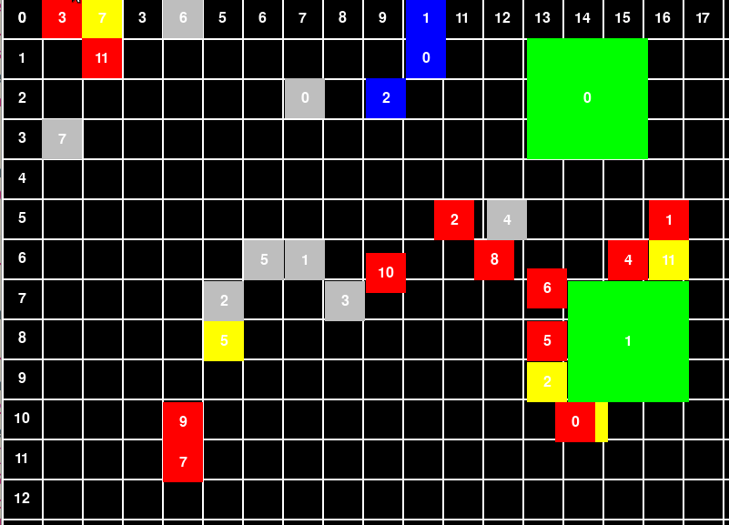
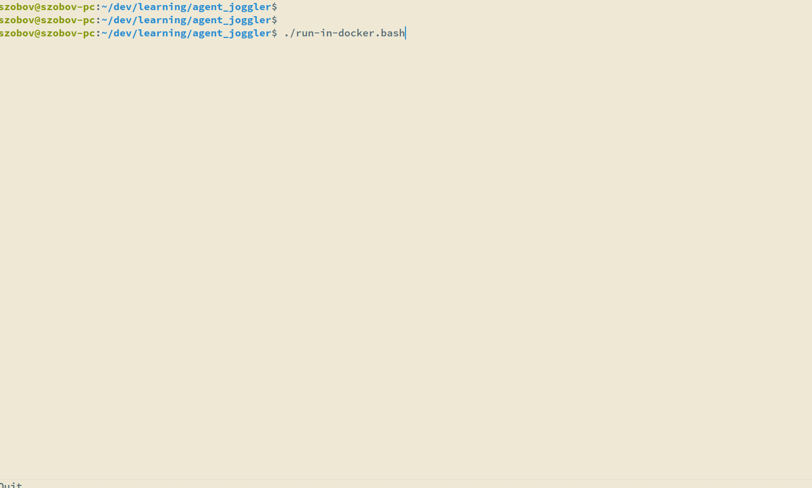

## Introduction

**aggent_joggler** is a warehouse simulator that implements multi-agent path planning with online task assignments. It simulates a dynamic environment with agents, blocked areas, stacks (with pallets), and pickup zones. The simulator continuously generates orders to transport pallets from stacks to pickup areas and redistributes pallets between stacks when necessary.

## Disclaimer

This project started after my presentation at [Berlin Robotics Meetup](https://www.meetup.com/berlin-robotics-meetup/events/292679480/?eventOrigin=group_past_events) ([slides](https://github.com/szobov/seminars/tree/main/cooperative-path-planning-seminar)), when I was asked a reasonable question: "Where is the code?"
The question motivated me to spend 15-20 minutes a day writing this project.
Another reason was that I didn't find other easy-to-grok implementations of Windowed Hierarchical Cooperative A\* algorithms, so I decided to implement mine.
So please take it with a grain of salt, and don't expect it to be polished.

## Features

- **Enhanced WHCA\***: Implements a modified version of [David Silver's WHCA* algorithm](https://www.davidsilver.uk/wp-content/uploads/2020/03/coop-path-AIWisdom.pdf) with online task assignment and path rebuilding.
- **Dynamic Task Assignment**: Tasks are continuously assigned to agents, imitating a continuous stream of orders.
- **Path Rebuilding**: Agents can rebuild their paths if blocked, enhancing flexibility and performance.
- **Multiprocessing**: Uses Python's `concurrent.futures` module for concurrent process execution.
- **ZeroMQ Communication**: Efficient message passing between simulator components.
- **Two UI Modes**:
  - **PyGame Interface**: View the simulation in a desktop environment.
  - **Dockerized Web Interface**: Run the simulation in docker and interact via a web browser.

## How It Works

The simulator follows these key principles:

- **Warehouse layout generation**: First, the layout grid is configured. Then, the objects are iteratively placed, such as the maintenance area (a place where agents start and come to idle), agents, pillars (unpassable areas), stacks, and pickup areas. A stack represents the set of enumerated pallets. 
- **Order Assignment**: Orders to move pallets are continuously generated and assigned to agents. There are three types of orders: free up, pickup, and delivery. An order always represents the movement of a pallet from the stack to pick up areas or to another stack. Since the delivery order may require a movement of a pallet from the middle or the top of the stack, the pallets that are blocking are redistributed to other stacks.
- **Path Planning**: Agents plan their paths using an enhanced WHCA* algorithm to execute the orders. The path for the agent is always sent "in the past" to create a space for replanning if some agents are blocked.
- **Visualization**: Show the simulation in "real" time. The unit of time is always set to **1**, which, in the current setup, is equal to one second. The agents are supposed to move with a constant speed, but the system is designed to easily extend it for non-constant speed.

## Run it yourself

Two entry points to run the system are available.

### Docker

The entry point is `./run-in-docker.bash`.
It requires only a bash-compatible shell, any Python, and the latest [docker](https://www.docker.com).
It provides a visualization as an HTML page.

### Local

The entry point is `./run-locally.bash`.
It will install all system dependencies and run a GUI version of the visualization.
Better suitable for developing.

## Contributing

The project utilizes [pre-commit](https://pre-commit.com) to run linters.
It is also heavily type-annotated, and tests are required to accept any code contributions.
Also, keep in mind that I didn't promise to accept any contributions, since it's a very much a fun hobby project.

## License
This project is licensed under the Apache 2.0 License. See the LICENSE file for more information.
